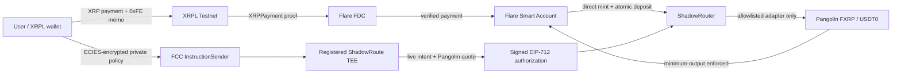

# ShadowRoute MVP

ShadowRoute is an FXRP-first confidential intent router for Flare. This repository contains the first executable vertical slice: users fund an intent identified by a ciphertext hash, a TEE-authorized signer approves one allowlisted route, and the router enforces the signed output token and minimum output before releasing funds.

**Live app:** https://shadowroute.vercel.app

**Hackathon submission:** [`SUBMISSION.md`](SUBMISSION.md)

**Demo recording guide:** [`DEMO_SCRIPT.md`](DEMO_SCRIPT.md)

## Summer Signal entry

ShadowRoute targets both **Interoperable Asset Products** and **Confidential Compute Apps**. It is designed for XRP holders and XRPFi applications that need to move value into Flare DeFi without publishing execution constraints such as minimum output, risk tolerance or venue preferences before settlement.

Flare is essential to the product: FDC proves the XRPL payment, FAssets supplies FXRP, Smart Accounts atomically deposit the minted asset, FCC privately evaluates the policy, and the ShadowRouter contract verifies the resulting authorization before an allowlisted Pangolin adapter can execute.

### Built during Summer Signal

- The `ShadowRouter` confidential-intent settlement contract and EIP-712 authorization model.
- Atomic XRPL payment → FDC proof → FXRP direct mint → Smart Account deposit integration.
- ShadowRoute's signed evaluator inside the official FCC extension scaffold.
- Encrypted FCC instruction submission and a registered Coston2 TEE reaching production status.
- A venue-pinned Pangolin adapter, seeded FXRP/USDT0 liquidity and router allowlisting.
- Two complete public testnet executions, including the current `0.594003 USDT0` delivery.
- A public judge experience with wallet-free evidence exploration and wallet-gated custom intent preview.

### Current limitations

- Testnet prototype only; contracts have not been independently audited.
- The public app demonstrates verified evidence and local commitment construction; it does not submit the full XRPL payment and FCC execution pipeline from the browser.
- The FCC proxy and simulated TEE must remain online during judging.
- Ownership is single-key in this MVP and should move to multisig plus timelocked governance.

### Roadmap

1. **Pilot:** add an in-app XRPL payment request, transaction progress tracking and recovery for interrupted FDC rounds.
2. **Harden:** commission contract review, move administration to multisig/timelock and add multiple independently operated route evaluators.
3. **Expand:** onboard more allowlisted venues and private policy types while preserving exact-calldata authorization.
4. **Launch:** deploy against production FAssets and support wallet partners or XRPFi applications through an intent SDK.

## Architecture



Public settlement remains verifiable on Flare. The route constraints are encrypted to the registered FCC machine and evaluated inside the TEE; the router accepts only a signature from its pinned evaluator key and only for exact calldata committed by the authorization.

## What is implemented

- `ShadowRouter.sol`: intent creation, funding, cancellation, TEE authorization, adapter allowlisting, pause control and output enforcement.
- `MockRouteAdapter.sol`: deterministic test route used only for local verification.
- Hardhat tests covering funding, authorized execution, forged authorization rejection and cancellation refunds.
- `fcc-scaffold/`: ShadowRoute's signed evaluator ported into Flare's official extension scaffold, with encrypted input, live funded-intent reads, private constraint evaluation and exact EIP-712 authorization signing inside the TEE runtime.
- A registered simulated TEE on Coston2, backed by the current FlareTeeManager and a stable HTTPS proxy, has completed the live provider delivery path.
- `scripts/demo.js`: deploys the local stack and runs an end-to-end 100 mFXRP → 200 mUSDT intent.
- `scripts/deploy-coston2.js`: deploys the router to Coston2 after an explicit TEE signer is configured.
- `integration/verify-coston2.mjs`: resolves and verifies the live Flare registry, AssetManagerFXRP, FTestXRP, Smart Accounts, FDC, Relay and FTSO contracts.
- `integration/smart-account.mjs`: creates the official 42-byte `0xFE` Smart Account memo and PackedUserOperation for atomic FXRP approval plus intent funding.
- `integration/fdc-xrp.mjs`: prepares, submits and retrieves an executor-bound `XRPPayment` proof and exposes the direct-mint execution call.
- `ShadowRouteInstructionSender.sol`: FCC instruction entry point using the official extension and machine registry interfaces.
- `UniswapV2RouteAdapter.sol`: venue-pinned spot adapter with router-only execution, bounded paths, deadline/slippage checks and temporary token approval.

This is prototype code and has not been audited. Do not deploy it with real assets.

## Run locally

Requirements: Node.js 20+ and Go 1.23+.

```bash
npm install
npm test
npm run demo
npm run test:integration
npm run verify:coston2
cd fcc-extension
go test ./...
go run .
```

The FCC process requires `TEE_SIGNER_PRIVATE_KEY` in its trusted runtime. Its derived address must match the router's configured `teeSigner`. Never place this value in `.env.example`, source code, a container image, or client-side configuration.

Start the local presentation demo separately:

```bash
npm run demo:web
```

Then open `http://127.0.0.1:4173`. It reads the live FTestXRP router balance and links to the XRPL, FDC and direct-mint evidence.

The legacy FCC-compatible mock service listens on `http://localhost:8080` only when
`SHADOWROUTE_ALLOW_PLAINTEXT_TEST_MODE=true`. It is deliberately disabled by default;
the secured deployable path is `fcc-scaffold/go`.

```bash
curl http://localhost:8080/health
```

Its decision endpoint is `POST /action/evaluate`. The service assumes the request has already been decrypted inside the trusted boundary. Client encryption and real FCC attestation are deliberately left for the next batch.

The same service also implements the official FCC `POST /action` and `GET /state` wire contract for `SHADOW_ROUTE/EVALUATE`, including the double-encoded `DataFixed` envelope and complete `ActionResult` response shape.

## Contract authorization model

The TEE signs an EIP-712 `RouteAuthorization` binding:

- Intent ID and owner
- Input token and maximum amount
- The canonical private-policy commitment stored as the intent's `ciphertextHash`
- Allowlisted adapter
- Expected output token
- Hash of exact adapter calldata
- Minimum output
- Intent nonce
- Authorization deadline

The canonical commitment covers chain, router, owner, input token, amount, intent nonce, intent expiry, the ordered allowed-adapter list, maximum risk and minimum output. Dynamic route quotes remain outside the commitment. The router measures its actual token balance change rather than trusting the adapter's reported output.

## Coston2 deployment

Copy `.env.example` to `.env` and configure a Coston2-funded deployer and a separate TEE signer address. Do not commit either private key.

```bash
npm run deploy:coston2
```

Hardhat loads the local `.env` through `dotenv`. Keep it uncommitted and never place private keys in source files.

Before deploying, confirm that all live Flare dependencies resolve and contain bytecode:

```bash
npm run verify:coston2
```

At the time of the latest verification, the registry resolved Coston2 `AssetManagerFXRP` to `0xc1Ca88b937d0b528842F95d5731ffB586f4fbDFA` and its `fAsset()` to FTestXRP `0x0b6A3645c240605887a5532109323A3E12273dc7`. The scripts resolve these dynamically rather than trusting these documented snapshots.

## Prepare the Smart Account interoperability route

After deploying the router, prepare the exact mint-and-deposit call for an XRPL account:

```bash
npm run prepare:mint-deposit -- <XRPL_ADDRESS> <SHADOW_ROUTER_ADDRESS> 1000000
```

The amount is in FTestXRP base units (six decimals). Set `SHADOW_ALLOWED_ADAPTER` to the reviewed adapter address first. The command reads the deterministic personal account and both live nonces, then outputs the `0xFE` XRPL memo, full PackedUserOperation and canonical private-policy commitment. It does not send an XRPL payment or spend funds.

To execute the full testnet path, use:

```bash
npm run run:mint-deposit -- <SHADOW_ROUTER_ADDRESS> 1000000
```

If a run stops after the XRPL payment and FDC request, do not send the payment again. Resume those exact transactions with:

```bash
npm run resume:mint-deposit -- <ROUTER> <XRPL_TX_HASH> <FDC_TX_HASH> 1000000
```

## Latest verified confidential Coston2 flow

- Current ShadowRouter: `0x3b9D9EaFf4D79A51505918c03989A16D5F84b511`
- Official FCC extension ID: `66196`
- Active production TEE: `0xF536C559248223B94cF8EA77f3E776859E5eCDb7`
- FlareTeeManager: `0x1a9C4A0f9D76c0b1D91d22E24E573a9b377618aE`
- XRPL payment: `27135C1598F4A1D64D9CA70B484FEE19311F9D34CA39D0C8451E93BAA7E3962A`
- FDC request: `0x61f2d64ef84aebb1bb01e9bcf62b3bdfc31c2a4f52fcec5b2cead9c9328ddb74`
- Direct mint and atomic intent funding: `0x2bb9fc9a8fa793a998e24b1d7bc385e7cfab2e8e0f4647d96afb24075c45415d`
- Encrypted FCC evaluation: `0xd6f0d0a63637f90ef2d481ee9e22e25fb731f90bd656bbf7a207c4a150292a53`
- FCC instruction ID: `0xe0bffa11481a7a46f281feb2a42e006837aba0bcef5a4984922800a068e9af59`
- Pangolin execution: `0xaed6ef40cc308c8c76425f50acc24a19aff1e00c9a6a2817621d1482aff2d598`
- Result: one FXRP was funded atomically, the FCC chose the pinned allowlisted Pangolin adapter, its signature and digest were independently verified, and `0.594003 USDT0` was delivered against a signed minimum of `0.560000 USDT0`.

Machine-readable records are in `deployments/coston2-mint-deposit-v2.json`, `deployments/coston2-fcc-evaluation-v2.json`, and `deployments/coston2-pangolin-execution-v2.json`.

## Historical verified Coston2 evidence

- ShadowRouter: `0x33d9BC1d038194138803a95D1C92BC4809C0bD54`
- XRPL payment: `A6C923C2B980001D7A65F5A0D4F652CCBFB8261872AC4A8E2AD7B104EAF2B6C8`
- FDC request: `0x89e5d4f73127c517c54cea1bfe252a5ca866114ebb9e8960d88bb04b1c8f0e94`
- Direct mint and atomic router deposit: `0x7f8a196e6939a74ee320edea1396bd7f690ea9df4a706177b1c636cacc3d0730`
- Pangolin FXRP/USDT0 liquidity: `0xe3b9515317a2b676873428f67e7fffd3d42494da2cd3efd20e7f21a6611bdc5a`
- Venue-pinned adapter deployment: `0x251c8f937030871f52640dc444261743e9448017bae67cf26367c20b2c624c5c`
- Adapter allowlisting: `0x816836931e1a253974b0f1b35c9ecdc9e6707b44ff31e63bafae8c4c069148ca`
- Signed live intent execution: `0xd6ce26eda0f8fbdf8259e3cb523a5526e939a70eea5324bbba166842a1b8ebe1`
- FXRP redemption request: `0x4adb56186c3e4006ab802b95405bc3706dba32d518d02a961ea17c023083b2c9`
- Validated XRPL redemption payment: `DCDDBD5D1ABCF1F389FB25BEEE03287178050E4CA8262B1ABD612CE1916A3484`
- Result: the Smart Account route minted and deposited `1.000000 FTestXRP`, the TEE-authorized adapter delivered `0.831248 USDT0` to the intent owner with a signed minimum of `0.814623 USDT0`, and a separate minimum-size `5 FXRP` redemption returned `4.975 XRP` to XRPL after the `0.025 XRP` protocol fee.

Machine-readable evidence is saved under `deployments/`, including the mint/deposit, Pangolin liquidity and final execution records.

## Liquidity adapter

Before deployment, independently verify that the proposed Coston2 venue address contains the expected V2-compatible router bytecode and that an FXRP output pool has usable testnet liquidity. Do not use an address copied from an unverified post.

Set these local values:

```text
SHADOW_ROUTER_ADDRESS=0x...
V2_EXCHANGE_ROUTER=0x...
```

Then deploy and atomically allowlist the venue-pinned adapter:

```bash
npm run deploy:v2-adapter
```

The deployment script refuses non-Coston2 networks, EOAs, missing bytecode and deployers that do not own the ShadowRouter. Encode the exact adapter payload committed by the FCC authorization with:

```bash
npm run encode:v2-route -- <TOKEN_IN>,<TOKEN_OUT> <MINIMUM_OUTPUT_BASE_UNITS> <DEADLINE_UNIX>
```

The adapter cannot invoke arbitrary targets or calldata. It accepts only an ABI-encoded token path of two to four unique tokens, minimum output and deadline; the exchange router and ShadowRouter addresses are immutable.

## FCC operations

The registered proxy URL must remain stable and reachable while the demo is being judged. The project pins the current `tee-proxy` develop revision used for the successful live flow. Before another evaluation, run `node scripts/check-fcc-live.mjs`; it confirms the public machine identity, registered URL and production status without printing credentials.

FCC remains beta. Its Coston2 registries are supplied by the official scaffold deployment config rather than `FlareContractRegistry`, and proxy operation requires Flare's read-only C-chain indexer credentials.

## Security boundaries

- The private-policy commitment is public on-chain; the policy itself is ECIES-encrypted to the registered TEE machine key before FCC submission.
- The evaluator's EIP-712 signing key is injected only into the trusted runtime and its public address is pinned in `ShadowRouter`.
- Settlement transfers remain public even when decision constraints are private.
- Adapters must be explicitly allowlisted, reviewed and constrained.
- Ownership is single-key in this MVP; production should use a multisig and timelocked signer/adapter changes.
- Dependencies reported by `npm audit` are development-tool dependencies. Review and update the toolchain before a production release.
- The official Flare ABI package brings legacy deployment-only transitive dependencies. Root overrides pin patched `axios`, `elliptic` and `ws`; the production audit currently has no high or critical advisories.
